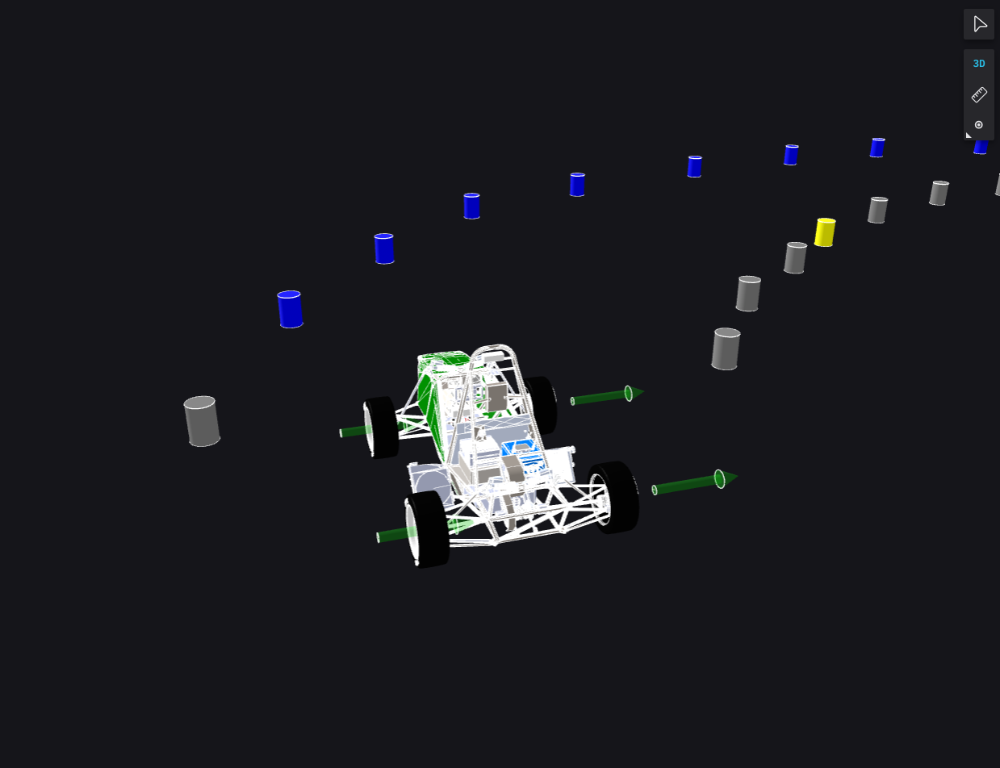
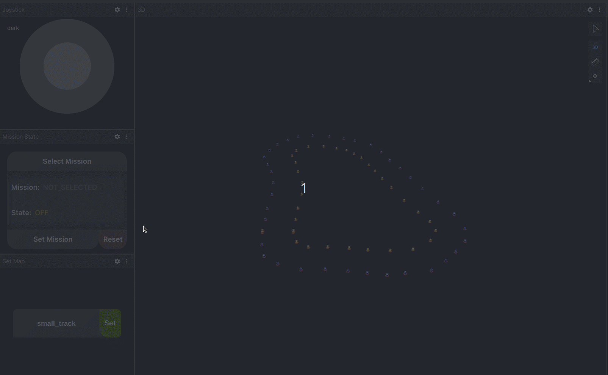

# Additional Plugins

This section provides a brief overview of the remaining plugins. It's useful for [configuring](./configuration.md) plugins or just to get a better understanding of eufs_sim2.


## Control input

The control input plugin subscribes to the `/cmd` topic and updates the vehicle's model *command* based on the latest received message. 


It processes messages of type [ackermann_msgs::msg::AckermannDriveStamped](https://docs.ros.org/en/jade/api/ackermann_msgs/html/msg/AckermannDrive.html), translating them into `eufs::sim2::type::ControlInput`. This internal type only stores the magnitude of acceleration and the steering angle, ignoring other fields from the original message.

Currently, there are two ways to send control messages:

1. Through the joystick in Foxglove
2. Via each team's Control algorithm


## Force publisher


This plugin publishes the forces acting on the car, as calculated by the vehicle model, to the `/plugin/force_publisher/car_forces` topic. It is mostly used as a debugging tool for the vehicle model.





## GT transform


The GT Transform plugin publishes the transform between the `map` (header) and `vehicle` (child) frames. This transform provides information about the relative translational and rotational difference between these frames. The message type is [geometry_msgs::msg::TransformStamped](https://docs.ros.org/en/jade/api/geometry_msgs/html/msg/TransformStamped.html).

<div class="custom-note note">
    <h2> Note </h2>
    <p>The child frame can be modified in the plugin configuration file.</p>
</div>


## Track changer

This plugin allows switching between tracks within the `map_lib/maps` shared directory. You can include your own map, provided it is [EUFS compatible](https://gitlab.com/eufs/localisation_group/map_lib). To add a new map:

1. Copy the map to `map_lib/maps`.
2. Build the package with:

```bash
eufs build map_lib
```

3.[]() Change the track using the `eufs sim map` command. The necessary information can be obtained by:

```bash
eufs sim map --help
```


Which returns

```txt
usage: eufs sim map [-h] [-a] map_path

Sets up a map in the sim given a path

Example: eufs sim map competitions/FSUK/2023/autocross

positional arguments:
  map_path             Relative path to map within eufs_maps

options:
  -h, --help           show this help message and exit
  -a, --absolute_path  Changes the path to an absolute path
```

Or even simpler, you can use the `Set Map` panel in [Foxglove](../user-guide/user-interface.md) as shown below.




## Vehicle State


Publishes odometry information to the `/ground_truth/odom` topic using the [nav_msgs::msg::Odometry](https://docs.ros.org/en/ros2_packages/humble/api/sensor_msgs/interfaces/msg/NavSatFix.html) message type. It provides information about position, linear velocity, as well as angular velocity between the `map` and `base_footprint` frames.


## Cone Collision Tracker


Cone collision tracker's main function is to publish cones that the car is colliding with. By default, cones that are considered "in range" of a configurable bounding box are also published.

The implementation is based on the [quad-tree](https://en.wikipedia.org/wiki/Quadtree), except in our case you have to explicitely define the number of grid cells in the x and y dimension.

| Param            | Description |
| ---------------- | ----------- |
| cones_frame_id   | The frame to publish any cones in |
| num_x_boxes      | The number of grid cells to have in the x dimension |
| num_y_boxes      | The number of grid cells to have in the y dimension |
| range_x_dim      | The x dimension of the bounding box for the cones published in `/plugin/cone_collision_tracker/in_range_cones` |
| range_y_dim      | The y dimension of the bounding box for the cones published in `/plugin/cone_collision_tracker/colliding_cones` |
| collision_radius | The distance a cone needs to be within from the car to be considered a collision |


## Summary

Plugin | Topic | Type |
------ | ----- | ---- |
Command input | /cmd | [ackermann_msgs::msg::AckermannDriveStamped](https://docs.ros.org/en/jade/api/ackermann_msgs/html/msg/AckermannDrive.html)
Force publisher | /plugin/force_publisher/car_forces | [eufs_msgs::msg::CarForces](https://gitlab.com/eufs/infrastructure_group/eufs_msgs/-/blob/master/msg/CarForces.msg?ref_type=heads)
GT transform | /tf | [geometry_msgs::msg::TransformStamped](https://docs.ros.org/en/jade/api/geometry_msgs/html/msg/TransformStamped.html)
Track Changer | - | - |
Vehicle State | /ground_truth/odom | [nav_msgs::msg::Odometry](https://docs.ros.org/en/ros2_packages/humble/api/sensor_msgs/interfaces/msg/NavSatFix.html)
Cone Collision Tracker | /plugin/cone_collision_tracker/in_range_cones | [eufs_msgs::msg::ConeWithColorProbabilityArray](https://gitlab.com/eufs/infrastructure_group/eufs_msgs/-/blob/master/msg/ConeWithColorProbabilityArray.msg?ref_type=heads)
Cone Collision Tracker | /plugin/cone_collision_tracker/colliding_cones | [eufs_msgs::msg::ConeWithColorProbabilityArray](https://gitlab.com/eufs/infrastructure_group/eufs_msgs/-/blob/master/msg/ConeWithColorProbabilityArray.msg?ref_type=heads)