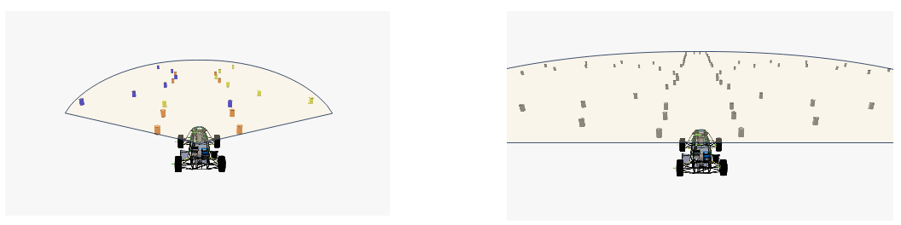
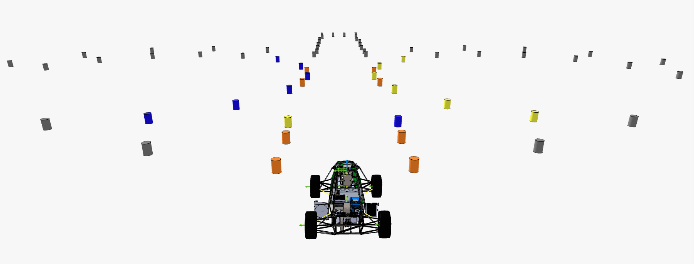

# Sensors

eufs_sim2 is equipped with a variety of sensors that enable the car to extract information from the simulated environment. The supported sensors are:


- <p style="font-size:21px;"> **IMU** (Inertial Measurement Unit) </p>

    Measures the acceleration, angular velocity, and orientation of the car.

    **Drift Simulation**
    To simulate real-world sensor imperfections, the IMU implementation includes a time-dependent drift feature. The noise added to the sensor data accumulates linearly over time (proportional to the simulation duration), calculated as `drift = drift_vector * time`.

    The drift rates for the X, Y, and Z axes can be configured via the following parameters in plugin_parmas.yaml:
        
        # Drift vector for angular velocity (rad/s per second)
        angular_velocity_drift_vector: [2.78e-7, 2.78e-7, 5.56e-7]

        # Drift vector for linear acceleration (m/s^2 per second)
        linear_acceleration_drift_vector: [2.72e-7, 2.72e-7, 2.72e-7]

- <p style="font-size:21px;"> **OSS** (Optical Speed Sensor) </p>

    Measures the longitudinal and lateral components of the car's relative velocity to the ground.


- <p style="font-size:21px;"> **GPS** (Global Positioning System) </p>

    More generally known to as GNSS (Global Navigation Satellite System), provides the global coordinates of the car as longitude and latitude.

- <p style="font-size:21px;"> **Wheel Speed** </p>

    Measures the speed of each of the four wheels as well as the steering angle.

- <p style="font-size:21px;"> **Camera & LiDAR** </p>

    Used for detecting cones. These sensors are not explicitly defined in the simulation, but their functionality is implemented through the [cone_fusion]("./plugins/sensors#Cone Fusion.md") plugin.

---

The sensors themselves don't directly expose or publish any data. This is done by their corresponding plugins.

<br>    

## Sensor plugins

These plugins read the appropiate data from the simulation and publish it at a set frequency. The published topic names can be modified through [remappings](./configuration.md#remappings), and their frequencies can be adjusted in the [configuration file](./configuration.md).


| Sensor      | Topic                         | Message Type                 |
|-------------|-------------------------------|----------------------------- |
| IMU         | */imu/data*                   | [sensor_msgs::Imu](https://docs.ros.org/en/ros2_packages/humble/api/sensor_msgs/interfaces/msg/Imu.html)                                         |
| OSS         | */plugin/oss_plugin/oss/data* | [geometry_msgs::TwistWithCovarianceStamped](https://docs.ros.org/en/jade/api/geometry_msgs/html/msg/TwistWithCovarianceStamped.html)                  |
| GNSS        | */plugin/gnss_plugin/fix*     | [sensor_msgs::NavSatFix](https://docs.ros.org/en/ros2_packages/humble/api/sensor_msgs/interfaces/msg/NavSatFix.html)                                   |
| Wheel Speed | */ros_can/wheel_speeds*       | [eufs_msgs::msg::WheelSpeedsStamped](https://gitlab.com/eufs/eufs_msgs/-/blob/b91e79ff0d4334a6e13aca20f803709f9d6c06bb/msg/WheelSpeedsStamped.msg)    |

<!-- <details>
<summary><b> Topic structure</b></summary>
<div style="padding: 10px; border: 1px solid #ccc; border-radius: 5px; background-color: #f9f9f9; margin-top: 5px;">
The topic structure for sensors is generally <em>/plugin/&lt;sensor_name&gt;/&lt;sensor_type&gt;/data</em>. The actual topic may differ due to each &lt;sensor_name&gt; and remappings.
</div>
</details> -->

<div class="custom-note note">
    <h2> Note </h2>
    <p>The topic structure for sensors is generally <code>/plugin/&lt;sensor_name&gt;/&lt;sensor_type&gt;/data</code>. The actual topic may differ due to each <code>sensor_name</code> and remappings.</p>
</div>


<br>

## Cone Fusion

Cone Fusion aims to emulate most aspects of the perception / localisation part of a stack when it comes to cone detection, doing the following:

 - Publish cones detected by individual sensors 
 - Publish the simulated output of all merged individual cone detections
 - Publish the entire map (potentially changed by track_changer)
 - Publish the ground truth map (unchanged - as read in from a csv file or message)

#### Publishing Individual Cones



Cone Fusion can independently publish outputs from individual sensors, allowing users to test custom cone fusing implementations, or simply view and listen to individual sensor output.

This is achieved in the config.yaml file in the following section:
```yaml
cone_fusion:
    sensor_names:
    - camera
    - lidar
    camera:
        fov_radians: 1.91889
        min_view_distance_meters: 1.0
        max_view_distance_meters: 20.0
        colour: true
        publish_own_cones: true
        cones_topic: "camera/cones"
        enabled: true
    lidar:
        fov_radians: 3.141593
        min_view_distance_meters: 1.0
        max_view_distance_meters: 100.0
        colour: false
        publish_own_cones: true
        cones_topic: "lidar_grid/cones"
        enabled: true
```
Here, we define the names of the sensors we would like to use in "sensor_names" (here, "camera" and "lidar"). 
When the plugin is initialised, it iterates through this list and creates sensors with those names, and populating them with the parameters found at "cone_fusion/*sensor_name*".
It is here that you set each sensors parameters:

| Sensor Param Name        | Type   | Default Value |
| ------------------------ | ------ | ------------- |
| fov_radians              | float  | 3.141593      |
| min_view_distance_meters | float  | 1.0           |
| max_view_distance_meters | float  | 20.0          |
| colour                   | bool   | true          |
| publish_own_cones        | bool   | true          |
| cones_topic              | string | ""            |
| enabled                  | bool   | true          |

#### Publishing Fused Cones

Cone Fusion can also emulated a cone fusing implementation, and publish the merged outputs of all sensors as one topic.



This is toggleable via "publish_gt_cones" parameter, located in the yaml as:
```yaml
cone_fusion:
    publish_gt_cones: true
```

#### Publishing the Map

The last job of Cone Fusion is to publish both the changed and unchanged map to their respective topics.
Being able to output a map can easily test global planning implementations without also running a mapping algorithm, and outputting a ground truth is useful for cone position checks.

These parameters are located in the yaml here, and are simple booleans:
```yaml
cone_fusion:
    publish_map: true
    publish_gt_map: true
```

Given that perception plugins are computationally expensive, they only publish whenever there is a subscriber. The default topics and remappings are:

| Topic Name                           | Default Topic Remapping | Message Type                                                                                                                            |
| ------------------------------------ | ----------------------- | --------------------------------------------------------------------------------------------------------------------------------------- |
| /plugin/cone_fusion/gt_cones         | /cones/lenient          | [eufs_msgs::msg::ConeWithColourProbabilityArray](https://gitlab.com/eufs/eufs_msgs/-/blob/master/msg/ConeWithColorProbabilityArray.msg) |
| /plugin/cone_fusion/cones            | /cones                  | [eufs_msgs::msg::ConeWithColourProbabilityArray](https://gitlab.com/eufs/eufs_msgs/-/blob/master/msg/ConeWithColorProbabilityArray.msg) |
| /plugin/cone_fusion/map              | /map                    | [eufs_msgs::msg::ConeWithColourProbabilityArray](https://gitlab.com/eufs/eufs_msgs/-/blob/master/msg/ConeWithColorProbabilityArray.msg) |
| /plugin/cone_fusion/ground_truth/map | /ground_truth/map       | [eufs_msgs::msg::ConeWithColourProbabilityArray](https://gitlab.com/eufs/eufs_msgs/-/blob/master/msg/ConeWithColorProbabilityArray.msg) |
| /plugin/cone_fusion/camera/cones     | /camera/cones           | [eufs_msgs::msg::ConeWithColourProbabilityArray](https://gitlab.com/eufs/eufs_msgs/-/blob/master/msg/ConeWithColorProbabilityArray.msg) |
| /plugin/cone_fusion/lidar_grid/cones | /lidar_grid/cones       | [eufs_msgs::msg::ConeWithColourProbabilityArray](https://gitlab.com/eufs/eufs_msgs/-/blob/master/msg/ConeWithColorProbabilityArray.msg) |


