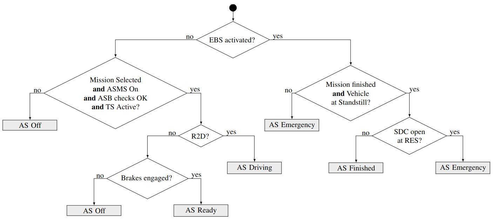

Talk about actual stateMachine, and then the StateMachine plugin.

# State Machine

The state machine ensures that the Autonomous States (AS) are correctly displayed, as specified by the [2024 Formula Student rules](https://www.formulastudent.de/fileadmin/user_upload/all/2024/rules/FS-Rules_2024_v1.0.pdf#figure.caption.25). 

### AS States

The AS states represent the phases of the car in autonomous missions. The AS flowchart is specified below: 

The possible AS states are defined in [eufs_msgs](https://gitlab.com/eufs/infrastructure_group/eufs_msgs/-/blob/master/msg/CanState.msg) with the following enumeration:

| Name                 | Enumeration |
|----------------------|-------------|
| AS_OFF               | 0           |
| AS_READY             | 1           |
| AS_DRIVING           | 2           |
| AS_EMERGENCY_BRAKE   | 3           |
| AS_FINISHED          | 4           |

### AMI States

The AMI states indicates the current autonomous mission. They are also defined in [eufs_msgs](https://gitlab.com/eufs/infrastructure_group/eufs_msgs/-/blob/master/msg/CanState.msg).

| Name                | Enumeration |
|---------------------|-------------|
| AMI_NOT_SELECTED    | 10          |
| AMI_ACCELERATION    | 11          |
| AMI_SKIDPAD         | 12          |
| AMI_AUTOCROSS       | 13          |
| AMI_TRACK_DRIVE     | 14          |
| AMI_AUTONOMOUS_DEMO | 15          |
| AMI_ADS_INSPECTION  | 16          |
| AMI_ADS_EBS         | 17          |
| AMI_DDT_INSPECTION_A| 18          |
| AMI_DDT_INSPECTION_B| 19          |
| AMI_JOYSTICK        | 20          |
| AMI_MANUAL          | 21          |

## State Machine Plugin

This plugin manages state machine updates and provides access through services and topics.

| Type       | Name                      | Message Type             | Description           |
|------------|----------------------------|-------------------------|-----------------------|
| Service    | /ebs                       | std_srvs::srv::Trigger  | Triggers the Emergency Brake System, bringing the vehicle to a halt |
| Service    | /go                        | std_srvs::srv::Trigger  | Go signal sent from the Remote Emergency System |
| Service    | /reset                     | std_srvs::srv::Trigger  | Resets the state machine to its initial values |
| Service    | /set_mission               | [eufs_msgs::srv::SetMission](https://gitlab.com/eufs/infrastructure_group/eufs_msgs/-/blob/master/srv/SetMission.srv) | Sets the AMI state given an enumeration (or name) |
| Subscriber | /driving_flag              | std_msgs::msg::Bool     | Go signal sent from the Remote Emergency System |
| Subscriber | /ros_can/mission_completed | std_msgs::msg::Bool     | Signals whether the mission has ended |

### Calling Services

The aforementioned services can be invoked through three main methods:

1. **ROS2 Command Line**: Use the standard [ROS2 service command line tool](https://roboticsbackend.com/ros2-service-cmd-line-tool-debug-ros2-services/) for direct service calls.

2. **EUFS CLI Shortcuts**:
    - eufs sim ebs
    - eufs sim go
    - eufs sim reset
    - eufs sim mission <name>

3. **Foxglove Interface**: Implemented through the Gross Funk and Mission State panels.

### Subscribing to Topics

Subscribers expose variables to topics, so that values can be changed just by sending a message. For example, sending `true` to `/ros_can/mission_completed`, indicates the end of the mission, reaching *finished* state.

    <h2> Note </h2>
    
<b>Set mission</b> can be activated when the vehicle is in the <em>off</em> state; <b>go </b> when in <em>ready</em> state; and <b>EBS</b> can be activated only in <em>ready</em> or <em>driving</em> states.
    

## State Publisher

Broadcasts the current AS and AMI states by sending an enumeration to `/sim/ros_can/state` and a readable string to `/sim/ros_can/state_str`.
