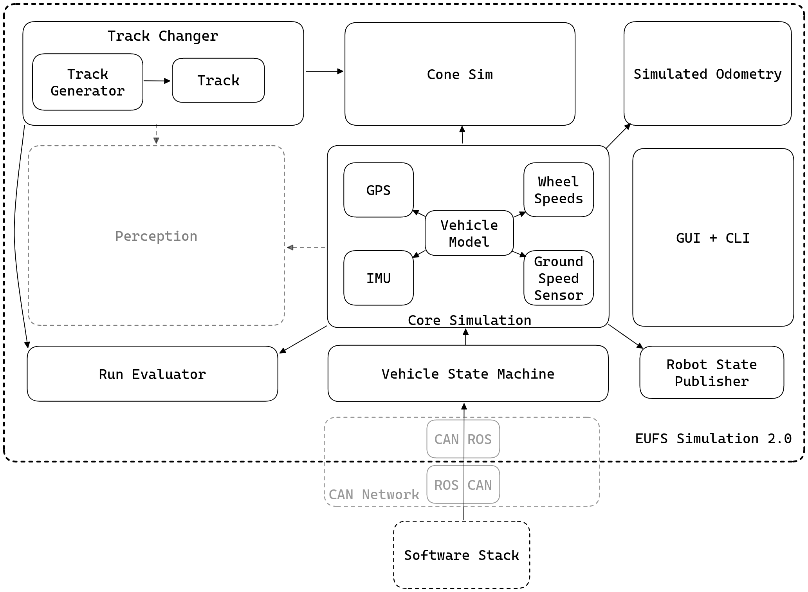
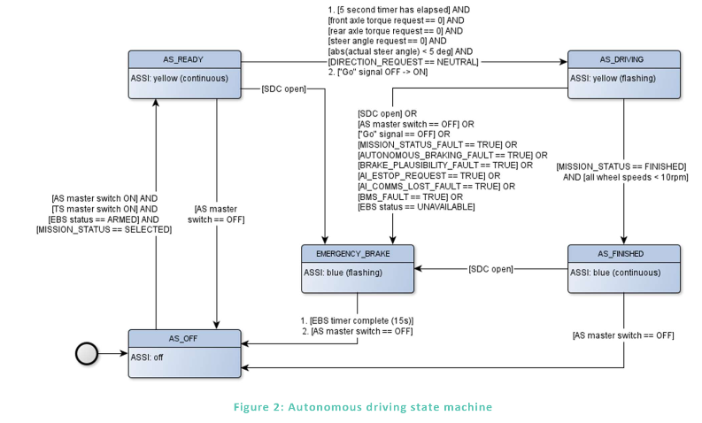

# Simulation Architecture

*This diagram is slightly outdated, but these are still the main components.*

## Core of simulation

### Vehicle model

Unlike typical physics engines like Gazebo, Unreal PhysX, and others, eufs_sim2 takes a different approach to vehicle simulation. At the heart of eufs_sim2 is the vehicle model, which drives the entire simulation. As of now, the simulation is currently using a 3 Degrees of Freedom (3 DoF) dynamic bicycle model. This model has been validated with real-world data from actual vehicle tests.

We have kept things simple on purpose. Instead of focusing on every little detail, like simulating physically accurate collisions, we are prioritizing accuracy in the vehicle model itself. This approach helps us avoid unnecessary complexity and keeps the simulation running smoothly in real-time. Real-time performance is especially important for tasks like Hardware-In-The-Loop (HIL) simulations, where the simulation needs to keep up with real-world hardware.

### Backend

eufs_sim2 uses ROS2 (Robot Operating System) as its backbone. If you are familiar with ROS2, the simulation itself is actually a ROS node. As seen from the provided architecture above, all of the other extensions (coming out of the Vehicle model) are simply child node of the simulation node (parent node). This architecture allows for a modular approach in adding more features to our simulator.

It is also worthwhile to note that since ROS2 is used as the main loop backend for our simulation, this ensures a soft real-time simulation to be achieved, hence allowing the capabilities of performing HIL simulation with our simulator.

  <h2> Note </h2>
  
 But here’s the cool part: the vehicle model is kept separate from the ROS2 backends. This means that developers have the flexibility to create their own physics engine loops while still taking advantage of our validated vehicle model. 

    <h2> Note </h2>
    
  Currently, as of eufs_sim2 v1.0.0, sped up simulation is not currently supported as a quick feature. However by setting the period and time step to custom values, this is achievable. 

## Core Simulation Plugins

As competitors of Formula Student, there are obviously some functional requirements that we need to meet in order to have our simulator to reflect the real-world environment of the competition. Some of the important requirements of the competition includes:

  - Vehicle
  - Tracks
  - Cones
  - Sensors

With that said, all of these important requirements have been covered with our simulator ensuring that the students are able to seamlessly test their software stack with the vehicle.

### Vehicle

Previously, we have discussed about the vehicle model which helps us in understanding the dynamic behaviour of the car given certain commands (e.g. steering and acceleration). However, for an autonomous car, there are some other features that have yet been covered with the vehicle model which includes the vehicle state machine.

The vehicle state machine is simply the state of the vehicle during its autonomous operation (e.g. READY or DRIVING). This allows us to ensure that our software is able to correctly switch between different conditions during the autonomous drive. The below figure provides the Autonomous System (AS) State machine of the ADS-DV. A more thorough explanation of the following diagram can be found from this [documentation](https://github.com/FS-AI/FS-AI_API/blob/main/Docs/ADS-DV_Software_Interface_Specification_v4.0.pdf).

|   Enumeration   | AS State |
|:---------------:|:--------:|
| OFF             |     0    |
| READY           |     1    |
| DRIVING         |     2    |
| FINISHED        |     3    |
| EMERGENCY_BRAKE |     4    |

  <h2> Tips </h2>
  
 Please note that the state machine provided is the Low Level State Machine that is implemented in the Vehicle Control Unit (VCU) of the ADS-DV. You may develop a higher level state machine which utilizes the state coming from the AS State of the vehicle to drive the car around in the simulator. Upon running the simulation, you should look for <code>/sim/ros_can/state</code> 

### Tracks

eufs_sim2 provides a selection of tracks which includes tracks for:

  - Acceleration
  - Skidpad
  - Autocross/Trackdrive

These are essentially the dynamic events that all Formula Student team would be competing in. EUFS has also open sourced the competition's maps which can be found in [map_lib](https://gitlab.com/eufs/localisation_group/map_lib). As seen from the architecture, the track changer is its own plugin where users can either use the track generator or the provided tracks to load the tracks into the simulation. The tracks consists of blue, yellow and orange cones in which the origin is the starting position of the vehicle.

Other than that, the `cone_fusion` plugin provides the relative cones' position from the car. This is then used to emulate the behaviour of our perception sensor. You should be able to find the position of the cones by subscribing to the `/cones` topic.

  <h2> Note </h2>
  
 Along with emulating perception by outputting fused cones, individual sensor output can be configured and published. 

### Sensors

Sensors such as GPS, IMU, Wheel speed sensor and Ground Speed Sensor are their own respective plugin. It utilizes the eufs_sim2 API to access the state members (e.g. x, y, yaw) data from the core simulation. This then allows us to get a ground truth data from each sensors.

  <h2> Note </h2>
  
 If you are new to the Formula Student competition, and would like to know more about it, FSUK provides a comprehensive rules that all teams would need to adhere. This information can be found here: <a href="https://www.imeche.org/docs/default-source/1-oscar/formula-student/2024/rules/fs-ai-2024-rules-v1-1.pdf?sfvrsn=2">FSAI 2024 rules</a>

