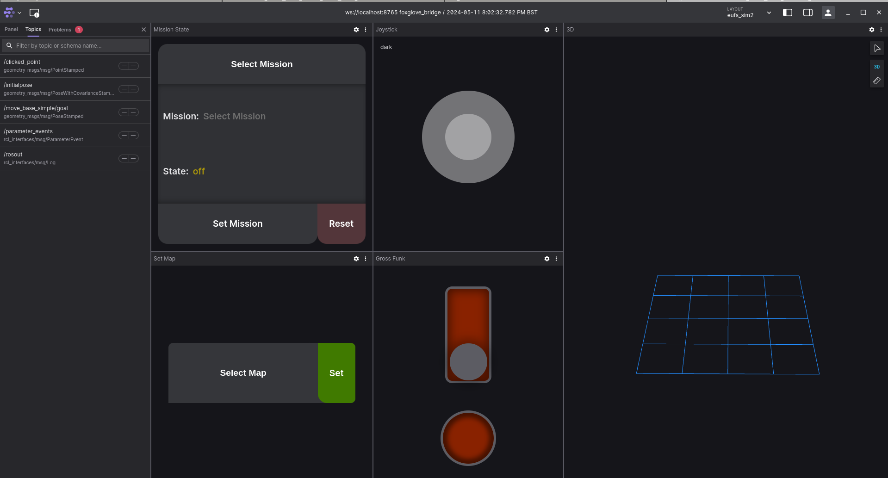

# User Interface

In the [Getting Started](getting-started.md) documentation, we have seen how to setup the simulation, and use [eufs_cli](https://gitlab.com/eufs/eufs_cli) to run the simulation. eufs_sim2 also provides a front end User Interface (UI) which utilizes Foxglove for our visualizations. Hence, it is necessary for you to install Foxglove via the following command:

```bash
sudo apt update && sudo apt install foxglove-studio
```

To get all of the necessary visuals up and running, you should install our custom made plugins for Foxglove which can be found [here](https://gitlab.com/eufs/eufs-sim-foxglove-plugins).

```bash
git clone --recursive https://gitlab.com/eufs/eufs-sim-foxglove-plugins.git
```

1. Once it is done, run Foxglove Studio and on the top right corner of the app, navigate to the **Layout** dropdown menu, then click on **Import from file**.
2. You should then import the **edinburghuniversityformulastudent.eufs-sim-foxglove-plugins-0.0.1.foxe** file that can be found in the repository cloned before.
3. You will then be prompted with several layout you can choose from. Here, the layout is all up to you, but the most important one for controlling eufs_sim2 through our user interface is:

    - **3D** - Allows the user to visualize the car on the map
    - **Mission State** - Allows the user to select different types of mission as per the FSUK rules
    - **Gross Funk** - Send GO and EBS signals to the car
    - **Joystick** - Allows the user to control the car via a Joystick when the car is set to **Manual Driving**
    - **Set Map** - Change the track

An example minimal layout is as shown below:


Feel free to set it up however you feel like it!

## Using Foxglove

With all of that setup, you're close to ready to being able to control the car! 

Go to your terminal and run

```bash
eufs sim run
```

Then, in a separate terminal, run the following command to run the **foxglove_bridge**

```bash
ros2 launch foxglove_bridge foxglove_bridge_launch.xml
```

Next, run the Foxglove Studio app, you should then be able to view the URDF of the vehicle in the 3D Panel, along with the cones in place right next to the car. If for any reason, the cones does not appear, click on the 3D Panel, and on the leftmost tab, click **Panel**. You should be able to see the list of topics that can be displayed, and ensure that you click on the **Eye** icon right next to the topic to ensure that the cones are visible. 

Note: If you see information tags on top of each cone and wish to disable it, go to 3D Panel -> Whichever cone topic is active -> Expand the topic -> Disable **InfoBox**.


### Running the car

1. In order to run the car in **MANUAL DRIVING** mode, you first need to set the Mission using the **Mission State** panel. The car should then transition from **OFF** to **READY** state.
2. Next, using the **Gross Funk** panel, flick the **GO** (long red switch) to allow the car to transition from **READY** to **DRIVING**.
3. You should now be able to move the car via the **Joystick** panel, or you can try and publish commands onto the `/cmd` topic through a custom ROS Node.
4. You can stop the car by activating the **EBS** using the Red button found on the **Gross Funk** panel.

The GIF given below is a quick demonstration of how you should be able to take control of the car.


Enjoy driving the car and best of luck!