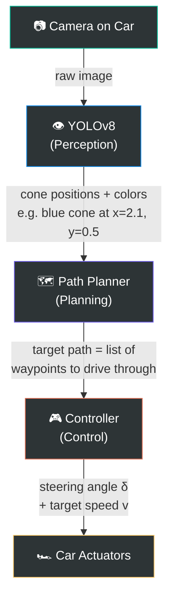

# Formula Student Driverless — Project Guide & Plan

## Part 1: Answering All Your Questions

I'm going to answer every question you asked, in detail. This is important foundational knowledge — don't skip it.

---

### Q: "Why not just use the EUFS open-source sim? Isn't that the whole point of open source?"

You're absolutely right to question this — using existing work IS the smart move when possible. Here's the honest situation:

| Factor | EUFS Sim | Your Setup |
|--------|----------|------------|
| **ROS version** | ROS 2 Humble | ROS 2 Jazzy |
| **Simulator** | Gazebo Classic (Ignition Fortress) | Gazebo Harmonic |
| **Ubuntu** | Ubuntu 22.04 | Ubuntu 24.04 |

The problem isn't ROS itself — it's that the **simulator plugin APIs changed** between Gazebo Classic and Gazebo Harmonic. So EUFS's world files, sensor plugins, and launch scripts won't just "work" if you copy them.

**Your realistic options are:**

1. **Dual-boot or Docker with Ubuntu 22.04 + Humble** → Use EUFS sim as-is. This works but means your own code also runs on Humble, not Jazzy. You'd eventually have to port everything to Jazzy anyway for competition.

2. **Build a minimal sim yourself on Jazzy + Gazebo Harmonic** → More work upfront, but everything stays on your target platform. And your sim is simpler than EUFS — you just need a flat plane, some colored cones, and a car with a camera.

3. **Hybrid** → Run EUFS in a Docker container for reference/inspiration, build your actual pipeline on Jazzy natively.

**My recommendation:** Option 2 for now, use EUFS as *reference* (look at their code to understand how they structured things), but build your own. Your simulation is genuinely simple — it's a flat surface with 20-50 small cones. That's achievable in a few days.

> [!TIP]
> You can absolutely look at the EUFS source code to learn how they set up their Gazebo world, car model, and sensor configuration — then adapt those concepts to Gazebo Harmonic's API. That's the smart way to use open source when the version doesn't match.

---

### Q: "What are Publishers, Subscribers, and Topics in ROS 2?"

This is the **most important concept** in ROS 2. Think of it like a radio station system:

```
┌─────────────┐         /camera/image_raw          ┌─────────────┐
│   CAMERA     │ ──── publishes to ────────────────▶│  DETECTOR    │
│   NODE       │        (the "topic")               │  NODE        │
│ (Publisher)  │                                     │ (Subscriber) │
└─────────────┘                                     └─────────────┘
```

- **Node** = A running program. Each piece of your pipeline is a "node." The camera is a node. Your cone detector is a node. Your steering controller is a node.

- **Topic** = A named channel/address where data flows. It's **not a file or folder** — it's like a TV channel or a radio frequency. The name `/camera/image_raw` is just a label, like a channel name. The `/` is just a naming convention (like a file path, but it's not a file).

- **Publisher** = A node that sends data TO a topic. "I'm broadcasting images on channel `/camera/image_raw`."

- **Subscriber** = A node that listens to data FROM a topic. "I'm tuned into channel `/camera/image_raw` and I'll process every image that arrives."

**Why is this useful?** Because nodes don't need to know about each other. The camera doesn't care WHO is listening. The detector doesn't care WHERE the images come from. You can:
- Swap the real camera for a simulated camera → same topic, detector doesn't change
- Add a second listener (e.g. a recording node) → just subscribe to the same topic
- Test your detector with saved images → publish saved images to the same topic

**Real example in your terminal:**
```bash
# List all active topics
ros2 topic list

# See what data is flowing on a topic
ros2 topic echo /camera/image_raw

# See how fast data arrives
ros2 topic hz /camera/image_raw
```

---

### Q: "What is YOLOv8?"

**YOLO = "You Only Look Once"**

It's a specific neural network architecture for **object detection** — meaning it takes an image and outputs:
- **Bounding boxes** (rectangles around detected objects)
- **Class labels** (what each object is — "blue cone", "yellow cone", "orange cone")
- **Confidence scores** (how sure it is)

```
┌──────────────────────────────┐
│  Input Image (from camera)   │
│                              │
│    🔵        🟡              │
│      🔵   🟡                 │
│        🔵  🟡                │
└──────────────┬───────────────┘
               │
         YOLOv8 Model
               │
               ▼
┌──────────────────────────────┐
│  Output:                     │
│  [blue_cone, x=120, y=340,  │
│   width=40, height=80,      │
│   confidence=0.95]           │
│  [yellow_cone, x=380, y=350,│
│   width=38, height=75,      │
│   confidence=0.91]           │
│  ...                         │
└──────────────────────────────┘
```

**YOLOv8** is the 8th version, made by a company called **Ultralytics**. It's:
- Built on **PyTorch** (so it fits your existing knowledge)
- Very fast (can run 30+ FPS even on modest hardware)
- The most commonly used model in Formula Student teams
- Trainable on custom datasets (like WEMAS cones)

**You already understand the core concepts** from your Snake DQN project:
- Snake DQN: state → neural network → action (move direction)
- YOLOv8: image → neural network → bounding boxes + labels

The difference is that YOLO is a **pre-designed architecture** that you fine-tune on your data, rather than designing from scratch.

---

### Q: "Is YOLOv8 the same as OpenCV?"

**No — they solve completely different problems:**

| | OpenCV | YOLOv8 |
|---|--------|--------|
| **What is it** | A library of image processing tools | A neural network for object detection |
| **Analogy** | A toolbox (hammer, screwdriver, etc.) | A trained expert eye |
| **What it does** | Resize images, draw rectangles, convert colors, apply filters, read video files | Find and classify objects in images |
| **Intelligence** | No learning — you write explicit rules | Learned from thousands of examples |
| **Example** | "Convert this image from RGB to grayscale" | "Find all cones in this image and tell me their colors" |

**You will actually use BOTH together:**
1. OpenCV reads the camera image and converts formats
2. YOLOv8 analyzes the image and finds cones
3. OpenCV draws the bounding boxes on the image for visualization

```python
import cv2                          # OpenCV - image handling
from ultralytics import YOLO        # YOLOv8 - object detection

image = cv2.imread("track.jpg")     # OpenCV reads the image
model = YOLO("cone_detector.pt")    # YOLOv8 loads your trained model
results = model(image)              # YOLOv8 finds cones
annotated = results[0].plot()       # Draw boxes (uses OpenCV internally)
cv2.imshow("Detection", annotated)  # OpenCV displays the result
```

---

### Q: "What is Foxglove? What are topics (again)?"

**Foxglove Studio** is a web-based visualization tool for ROS 2. Think of it as a dashboard where you can see:
- Camera feeds
- 3D point clouds
- Graphs of sensor data
- Robot position on a map

It connects to your ROS 2 system and subscribes to **topics** (the radio channels I explained above) to display the data visually. **RViz2** is the built-in ROS 2 equivalent. You can use either — RViz2 is already installed with your Jazzy setup.

---

### Q: "Don't I need to start with the car model and driving script first?"

**Yes, exactly!** You're right. The correct order is:

1. First you need a car that EXISTS in the simulation
2. Then you need a camera ON that car
3. Then you need cones IN the world for the camera to see
4. THEN you can run detection on the camera images

The Milestone 1 I described follows that exact order — I should have made it clearer. See the updated roadmap below.

---

### Q: "I don't have a GPU — should I worry about training?"

**Not right now.** You're correct to think "start small, get it working." Here's the plan:

1. **Phase 1 (now):** Get the simulation working. No GPU needed — Gazebo runs on CPU.
2. **Phase 2 (soon):** For YOLOv8 inference (running the already-trained model), you can use CPU. It'll be slower (~5 FPS vs 30 FPS) but perfectly fine for development.
3. **Phase 3 (later):** For training YOLOv8 on cone data, use **Google Colab** (free GPU) or your team's server. Training happens once, separately — you don't need a local GPU for it.

---

## Part 2: Your Understanding of the Pipeline — Corrected

You described the pipeline as:

> "YOLOv8 sees cones → neural network decides what to do → outputs steering + speed"

That's 90% right! Let me refine it:



**The key insight:** The "deciding what to do" part is typically NOT a neural network — it's **geometry/math**:

1. **Perception (YOLOv8):** "I see blue cones on my left, yellow cones on my right"
2. **Planning (math, not ML):** "The middle of the track is between the blue and yellow cones → I should aim for these midpoints" — this is just averaging coordinates
3. **Control (math, not ML):** "To reach that target point, I need to steer 15° left and go 20 km/h" — this is a formula called **Pure Pursuit** or a PID controller

> [!NOTE]
> Some advanced teams DO use neural networks for planning/control (end-to-end learning), but that's much harder to debug and validate. The standard approach — and what the judges expect to see explained — is the modular pipeline above. Start with the math-based approach; you can experiment with RL/neural control later.

### How This Maps to the 2026 Spec

From the spec you shared, the car must report via CAN bus (Table in DS 2.2):
- `Speed_actual` and `Speed_target` (km/h)
- `Steering_angle_actual` and `Steering_angle_target` (degrees, 0.5° resolution)
- `Brake_hydr_actual/target` (%)
- `Motor_moment_actual/target` (%)

So your **controller's outputs** eventually become these CAN messages. In simulation, they're just ROS 2 topics. On the real car, a bridge node converts ROS 2 → CAN bus.

---

## Part 3: Updated Phased Roadmap

Since you want to learn and build yourself, here's what YOU should do, in order. I'll advise, you execute.

### Phase 1: Simulation Foundation (No ML yet)

| Step | What YOU do | What You Learn |
|------|-------------|----------------|
| **1a** | Verify Gazebo Harmonic is installed, launch an empty world | Gazebo basics |
| **1b** | Create a car URDF model (box + wheels + camera) | URDF, robot modeling |
| **1c** | Spawn the car in Gazebo, see camera feed in RViz2 | `ros_gz_bridge`, topic bridging |
| **1d** | Create cone models (colored cylinders/cones in SDF) | SDF model format |
| **1e** | Build a track world with cones (straight + one turn) | World building |
| **1f** | Drive the car manually with keyboard teleop | `teleop_twist_keyboard` |

**End of Phase 1:** You can drive a car around a cone track in simulation and see the camera feed.

### Phase 2: Perception (YOLOv8)

| Step | What YOU do | What You Learn |
|------|-------------|----------------|
| **2a** | Explore the FSOCO dataset, understand annotation format | Object detection data |
| **2b** | Train YOLOv8 on FSOCO in Google Colab | Transfer learning, fine-tuning |
| **2c** | Write a ROS 2 node that subscribes to camera, runs YOLOv8 | ROS 2 nodes, cv_bridge |
| **2d** | Visualize detections (bounding boxes) in RViz2 | Debugging perception |

**End of Phase 2:** Your system sees cones from the Gazebo camera and classifies them by color.

### Phase 3: Planning + Control (Math-based)

| Step | What YOU do | What You Learn |
|------|-------------|----------------|
| **3a** | Write a midpoint path planner (blue↔yellow cone pairs → midpoints) | Geometry, path planning |
| **3b** | Write a Pure Pursuit controller | Control theory basics |
| **3c** | Close the loop — car drives autonomously around the track | System integration |

**End of Phase 3:** The car drives itself around the simulated track. 🎉

### Phase 4+ (Future)

- SLAM and mapping (car remembers the track across laps)
- Optimization (racing line, MPC controller)
- Real hardware deployment (Jetson, real cameras, CAN bus)

---

## Proposed Workspace Structure

```
test_ws/src/
├── fs_msgs/            # Custom ROS 2 message definitions
│   └── msg/
│       ├── Cone.msg         # Single cone: x, y, color
│       └── ConeArray.msg    # Array of detected cones
├── fs_description/     # Car model (URDF/Xacro files)
│   ├── urdf/
│   │   └── car.urdf.xacro
│   └── launch/
│       └── display.launch.py
├── fs_gazebo/          # Simulation world + cone models
│   ├── worlds/
│   │   └── simple_track.sdf
│   ├── models/
│   │   ├── cone_blue/
│   │   ├── cone_yellow/
│   │   └── cone_orange/
│   └── launch/
│       └── sim.launch.py
├── fs_perception/      # YOUR existing package → cone detection
│   └── fs_perception/
│       └── cone_detector_node.py
├── fs_planning/        # Path planner (Phase 3)
├── fs_control/         # Steering controller (Phase 3)
└── fs_bringup/         # Top-level launch files
```

---

## Open Questions for You

> [!IMPORTANT]
> 1. **Do you want to start with Phase 1a right now?** (Verify Gazebo Harmonic is installed, launch an empty world) — I can tell you exactly what commands to run.

> [!NOTE]
> 2. **Your understanding is solid.** You correctly identified the core loop: see cones → decide → steer + speed. The only refinement is that the "decide" part is usually math (not a neural network), at least to start. Are you comfortable with that approach, or do you specifically want to try end-to-end neural control from the start?

> [!NOTE]
> 3. **From the 2026 spec:** The track events are Acceleration (straight line), Skidpad (figure-8), and Trackdrive (10-lap circuit). Which one do you want to simulate first? I recommend **Acceleration** — it's just a straight line between cones, simplest possible track.
